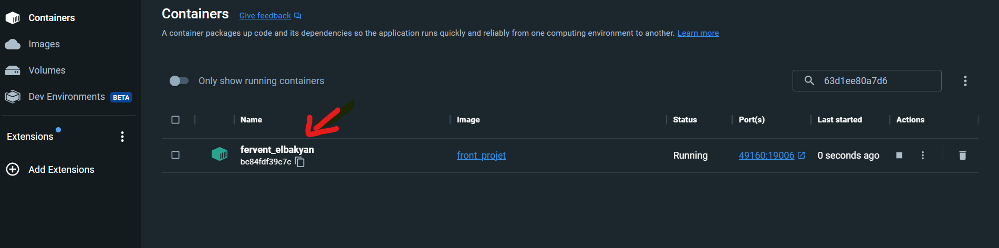
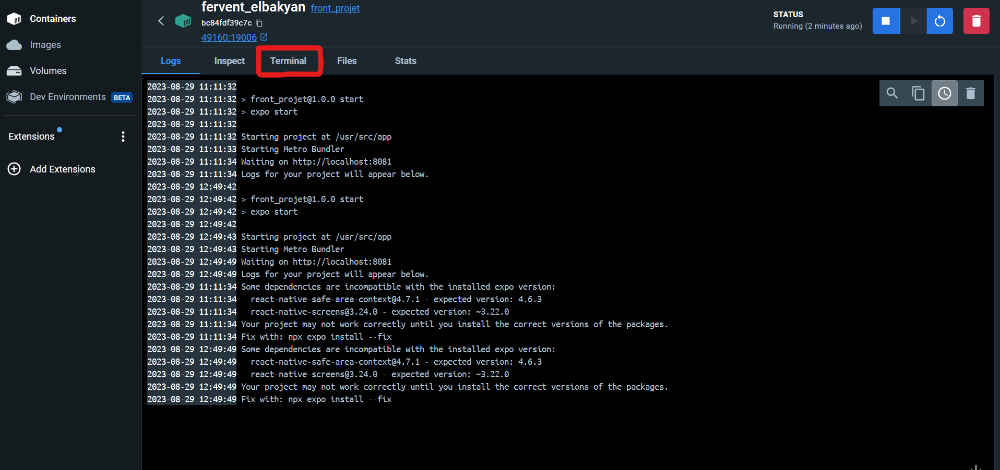
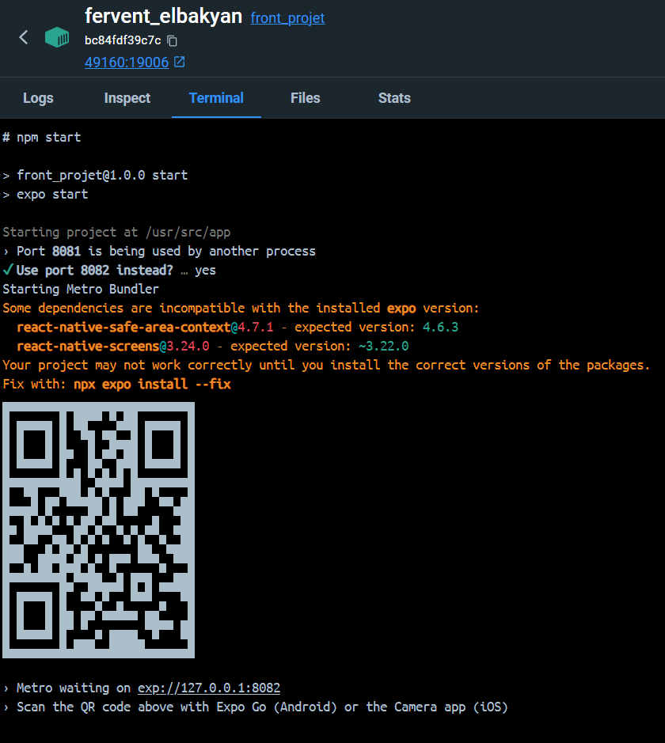
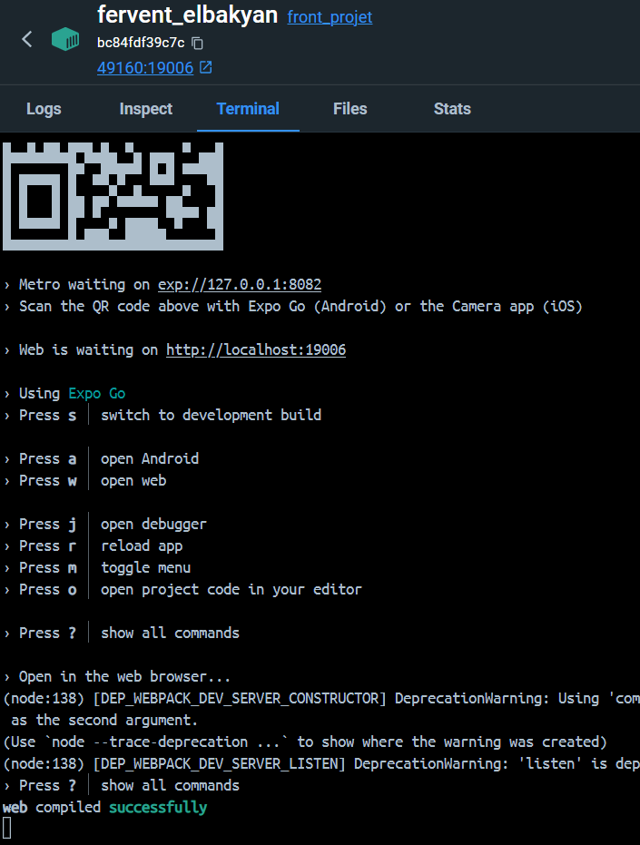
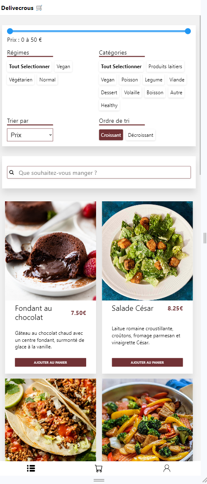

# Delivecrous - Front
Here's the visual part of a mobile application made with React Native, resembling an app similar to Uber Eats.

## Table of Contents

- [Prerequisites](#prerequisites)
- [Installation](#installation)
- [Installation with Docker](#installation-with-docker)
- [Usage](#usage)
- [Contributing](#contributing)
- [License](#license)

## Prerequisites

To launch the project, you first need to download the latest version of Node.js: https://nodejs.org/en. The recommended version for most users at the time of writing this README is 18.17.1 LTS.

To check if the installation was successful, you can open your Terminal or Command Prompt and type `node -v`, which should return the installed version of Node.js, and `npm -v`, which should return the installed version of npm.

## Installation

```bash
# Clone the repository
git clone https://github.com/theoernould/projet-rentree-front.git

# Go to the project directory
cd projet-rentree-front

# Install dependencies
npm install

# Launch the project
npm start

# Launch in a web application
w
```

## Installation with Docker

### Install Docker

To launch our front end with Docker, you first need to download and install it. Here are the links to the guides for [Windows](https://docs.docker.com/desktop/install/windows-install/), [Mac](https://docs.docker.com/desktop/install/mac-install/), and [Linux](https://docs.docker.com/desktop/install/linux-install/).

### Install the Project

- Open a terminal in a directory

```bash
# Download the project files
git clone https://github.com/theoernould/projet-rentree-front.git

# Go to the project directory
cd projet-rentree-front
```

### Create the Docker Image

```bash
# Build the image
docker build . -t front_projet

# Run a container from the image, redirecting port 19006 of the Docker machine to port 19006 of your machine
docker run -p 19006:19006 -d front_projet
```

You can then go to Docker Hub and click on the container with a random name. But you will see that the image is correctly named "front_projet".


You will see several options; click on the "terminal" tab.


You can then perform the following commands in the terminal:

```bash
# Launch the project
npm start

# Launch in a web application
w
```




You can visit port [49160](http://localhost:19006/) to see our beautiful application :D



